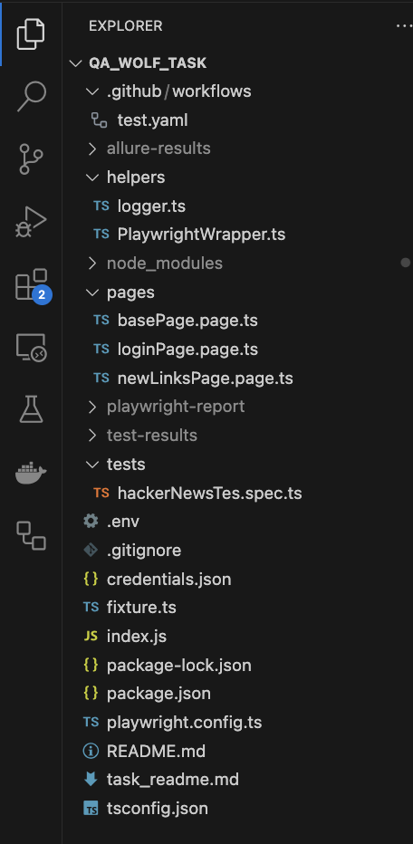
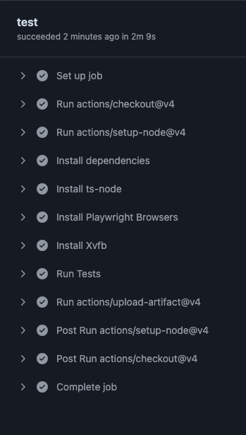
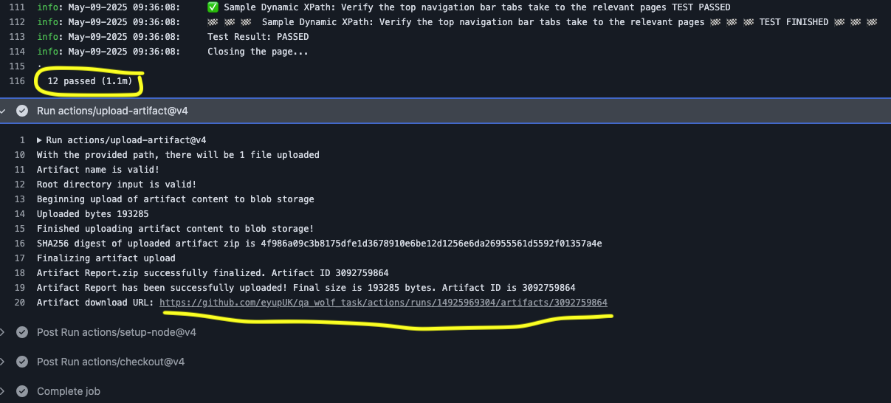
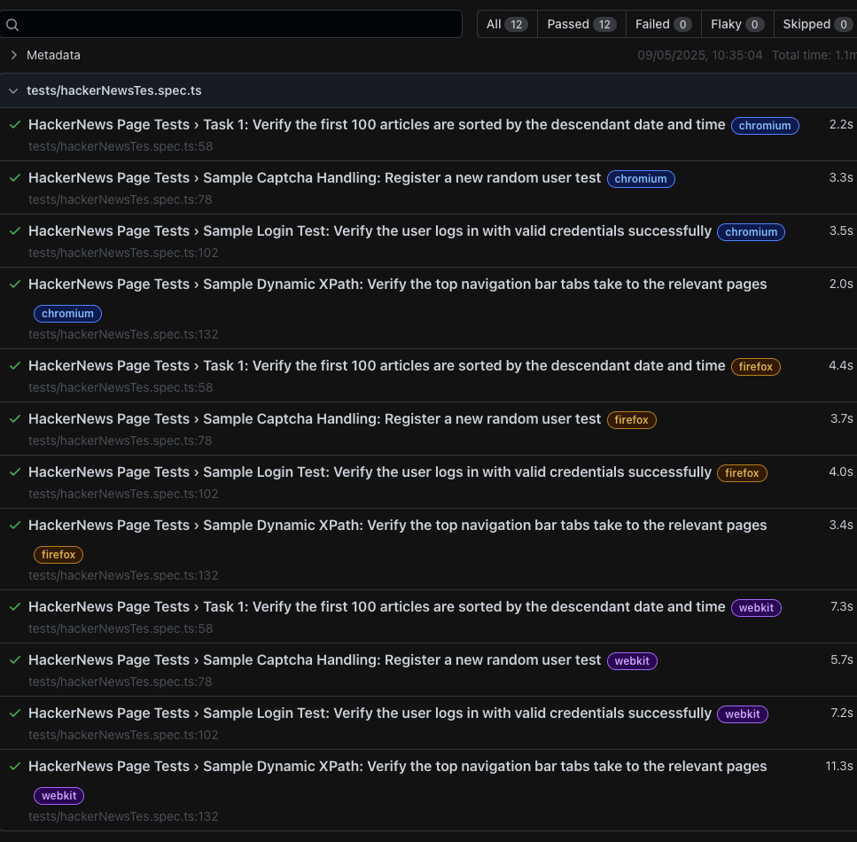

# 🧪 QA Wolf Hacker News – Test Automation Framework

This is a **Playwright-based test automation framework** designed for the **QA Wolf Hacker News Task**. It includes enhanced logging capabilities using **Winston logger**, detailed reporting with **Allure Reports**, and a modular structure for maintainable and scalable test automation.
I also implemented 3 more test cases in order to show my implementations of **POM and Wrapper class** that I really enjoyed with.
In this task, I used **Typescript** as an OOP language and **GitHub Actions** as a CI/CD pipeline platform, which is I feel more comfortable.

I am really exicited to move forward to the next stage.

---


## ⚙️ Pre-requisites

Before running the tests, ensure you have the following installed on your system:

1. **Node.js** (v16 or higher) and **npm**:
   - Download and install from [Node.js official website](https://nodejs.org/).

2. **Allure Commandline** (for generating Allure reports):
   - Install globally using npm:

     ```bash
     npm install -g allure-commandline --save-dev
     ```

3. **Git** (optional, for version control):
   - Download and install from [Git official website](https://git-scm.com/).

## 📁 Folder Structure



```
qa_wolf_take_home/
├── tests/ # Contains test specs written using Playwright
│ └── hackerNewsTest.spec.ts
├── pages/ # Page Object Models (POM) for each application page
│ ├── basePage.page.ts
│ ├── loginPage.page.ts
│ └── newLinksPage.page.ts
├── helpers/ # Utility functions (e.g., logging, Allure integration)
│ ├── logger.ts
│ └── PlaywrightWrapper.ts
├── test-results/logs/ # Test execution logs created by Winston logger
│ └── test-execution.log
├── allure-results/ # Allure raw result files (auto-generated)
├── allure-report/ # HTML Allure report (generated after tests)
├── playwright-report/ # Playwright HTML report output
├── test-results/ # Playwright test output
├── fixture.ts # Test fixtures for shared setup and teardown logic
├── playwright.config.ts # Playwright configuration file
├── credentials.json # Credential management (should be kept secret)
├── .env # Environment variables file
├── .gitignore # Git ignore file
├── package.json # Project metadata and dependencies
├── package-lock.json # Dependency lock file
└── README.md # Project documentation (you're reading it!)
```

## ✨ Features

- **Playwright Test Runner**: Enables browser automation and test execution.
- **Page Object Model (POM)**: Provides maintainable and reusable test code for each application page.
- **PlaywrightWrapper**: Provides custom reusable methods for Playwright interactions.
- **Winston Logger Integration**:
  - Captures logs for each test run in `test-results/logs/<testTitle>.log`.
  - Logs are also attached to Allure reports for better debugging.
- **Allure Reporter Integration**:
  - Generates detailed and interactive reports for test execution.
- **Custom Hooks**:
  - Includes setup and teardown logic to set up Logger or anything else if needed.
  - Automatically attaches logs.
- **Environment Handling**:
  - Uses `.env` for managing environment variables, such as `BASE_URL`, `WORKERS`, `HEADLESS`.
- **Parallel Test Execution**: Supports running tests in parallel for faster execution.

### Test Execution of GitHub Actions 


### Test Completion of GitHub Actions


### Playwright Test Report of GitHub Actions



---

## 🚀 How to Run the Tests

### 1. Install dependencies

```bash
   npm i
```

### 2. Install Playwright

```bash
   npx playwright install
```

### 3. Run the tests

```bash
   npm run test
```

### 4. Run the tests in UI mode

```bash
   npm run test:ui
```

### 5. Generate Allure report

```bash
   allure serve
```
or 
```bash
   npm run allure
```

### 6. Clean test results
```bash
   npm run clean
```

### 🧠 Notes

#### Ensure allure-commandline is installed globally if you plan to use Allure frequently

```bash
npm install -g allure-commandline --save-dev
```

#### Add sensitive files to .gitignore to avoid pushing them to version control, such as credentials.json, .env and logs...

#### The fixture.ts file provides shared setup logic for browser, context, and logging. It integrates the Winston logger for capturing test logs

### 🛠️ Dependencies

Playwright: Browser automation framework.

Winston: Logging library for capturing test execution logs.

Allure Playwright: Integration for generating Allure reports.

dotenv: For managing environment variables.

@faker-js/faker: For generating random test data.
