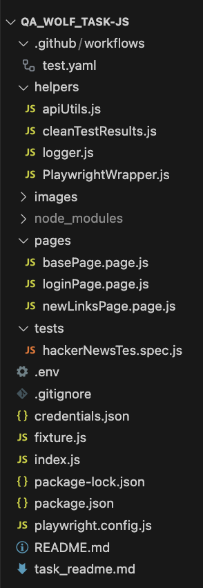

# 🧪 QA Wolf Hacker News – Test Automation Framework

This is a **Playwright-based test automation framework** designed for the **QA Wolf Hacker News Task**. It includes enhanced logging capabilities using **Winston logger**, detailed reporting with **Allure Reports**, and a modular structure for maintainable and scalable test automation.
I also implemented 3 more test cases in order to show my implementations of **POM and Wrapper class** that I really enjoyed with.
In this task, I used **Typescript** as an OOP language and **GitHub Actions** as a CI/CD pipeline platform, which is I feel more comfortable.

I am really exicited to move forward to the next stage.

---


## ⚙️ Pre-requisites

Before running the tests, ensure you have the following installed on your system:

1. **Node.js** (v16 or higher) and **npm**:
   - Download and install from [Node.js official website](https://nodejs.org/).

2. **Allure Commandline** (for generating Allure reports):
   - Install globally using npm:

     ```bash
     npm install -g allure-commandline --save-dev
     ```

3. **Git** (optional, for version control):
   - Download and install from [Git official website](https://git-scm.com/).

## 📁 Folder Structure



```
qa_wolf_task/
├── tests/                # Test specifications
│   └── hackerNewsTes.spec.ts
├── pages/                # Page Object Models (POM)
│   ├── basePage.page.ts
│   ├── loginPage.page.ts
│   └── newLinksPage.page.ts
├── helpers/              # Utility functions
│   ├── logger.ts         # Winston logger integration
│   ├── PlaywrightWrapper.ts
│   ├── apiUtils.ts
│   └── cleanTestResults.ts
├── test-results/         # Test execution logs and results
├── allure-results/       # Allure raw result files
├── playwright-report/    # Playwright HTML reports
├── fixture.ts            # Shared setup/teardown logic
├── playwright.config.ts  # Playwright configuration
├── credentials.json      # Credential management
├── .env                  # Environment variables
├── .gitignore            # Ignored files
├── package.json          # Project metadata and dependencies
├── README.md             # Project documentation
└── task_readme.md        # Assignment instructions
```

## ✨ Features

- **Playwright Test Runner**: Enables browser automation and test execution.
- **Page Object Model (POM)**: Provides maintainable and reusable test code for each application page.
- **PlaywrightWrapper**: Provides custom reusable methods for Playwright interactions.
- **Winston Logger Integration**:
  - Captures logs for each test run in `test-results/logs/<testTitle>.log`.
  - Logs are also attached to Allure reports for better debugging.
- **Allure Reporter Integration**:
  - Generates detailed and interactive reports for test execution.
- **Custom Hooks**:
  - Includes setup and teardown logic to set up Logger or anything else if needed.
  - Automatically attaches logs.
- **Environment Handling**:
  - Uses `.env` for managing environment variables, such as `BASE_URL`, `WORKERS`, `HEADLESS`.
- **Parallel Test Execution**: Supports running tests in parallel for faster execution.

### Test Execution of GitHub Actions 


### Playwright Test Report of GitHub Actions


---

## 🚀 How to Run the Tests

### 1. Install dependencies

```bash
   npm i
```

### 2. Install Playwright

```bash
   npx playwright install
```

### 3. Run the tests

```bash
   npm run test
```

### 4. Run the tests in UI mode

```bash
   npm run test:ui
```

### 5. Generate Allure report

```bash
   allure serve
```
or 
```bash
   npm run allure
```

### 6. Clean test results
```bash
   npm run clean
```

### 🧠 Notes

#### Ensure allure-commandline is installed globally if you plan to use Allure frequently

```bash
npm install -g allure-commandline --save-dev
```

## 🔑 Core Components
### 1. Test Cases (tests/hackerNewsTes.spec.ts)
- Task 1: Verifies the first 100 articles are sorted by descending date.
- Task 2: Handles CAPTCHA and registers a random user.
- Task 3: Verifies login functionality with valid credentials.
- Task 4: Validates navigation tabs on the Hacker News page.
- API Test: Verifies user account details using the Hacker News API.

### 2. Page Object Models (POM)
- pages/basePage.page.ts
Provides navigation utilities for the Hacker News website.
Example: Navigating to tabs like "new", "past", "comments".
- pages/loginPage.page.ts
Handles login, user registration, and CAPTCHA detection.
Example: Registers a random user using faker.
- pages/newLinksPage.page.ts
Fetches and validates article creation dates.
Example: Ensures articles are sorted by descending timestamps.

### 3. Helpers
- helpers/PlaywrightWrapper.ts

Provides reusable methods for interacting with Playwright locators.
Example: waitAndClickOnElementByLocatorAPI.
- helpers/logger.ts

Configures Winston logger for capturing test execution logs.
Example: Logs test start, pass, and failure messages.
- helpers/apiUtils.ts

Provides utility functions for making HTTP requests.
Example: Sends GET requests to the Hacker News API.
- helpers/cleanTestResults.ts

Deletes test result directories like test-results/, allure-results/, and playwright-report/.

### 4. Configuration
- playwright.config.ts

Configures Playwright settings like baseURL, headless, and reporters.
Example: Enables Allure and HTML reporting.
- .env

Stores environment variables like BASE_URL and HEADLESS.

## 🛠️ CI/CD Pipeline
The project includes a GitHub Actions workflow to automate test execution:

Triggers:

On push to main or master branches.

Steps:

Installs dependencies and Playwright browsers.
Runs tests using xvfb-run for headless execution.
Uploads Playwright reports as artifacts.

## 🧠 Notes
#### Add sensitive files to .gitignore to avoid pushing them to version control, such as credentials.json, .env and logs...

#### The fixture.ts file provides shared setup logic for browser, context, and logging. It integrates the Winston logger for capturing test logs

### 🛠️ Dependencies

Playwright: Browser automation framework.

Winston: Logging library for capturing test execution logs.

Allure Playwright: Integration for generating Allure reports.

dotenv: For managing environment variables.

@faker-js/faker: For generating random test data.

cross-env: For handling cross-platform issues, like folder path confusions of windows and linux/mac 

axios: For API calls
